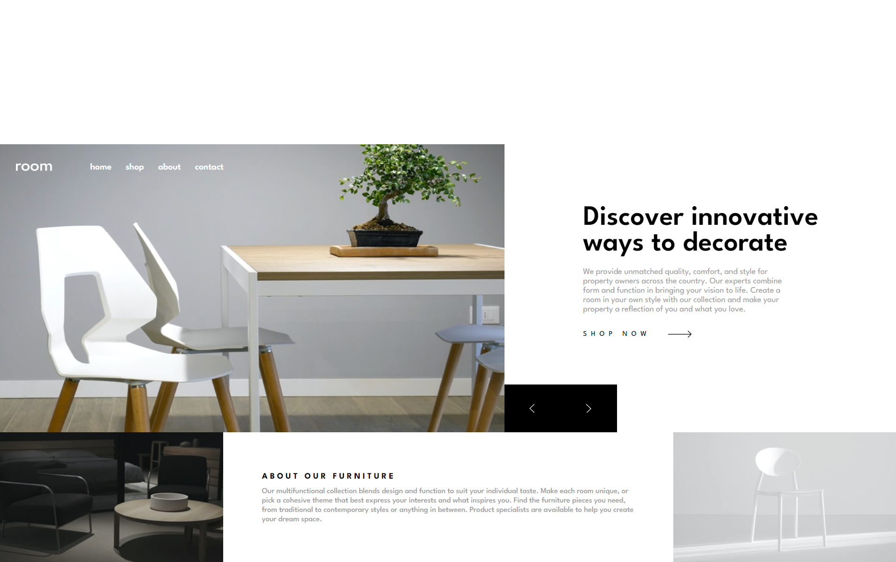

# Frontend Mentor - Room homepage solution

This is a solution to the [Room homepage challenge on Frontend Mentor](https://www.frontendmentor.io/challenges/room-homepage-BtdBY_ENq). Frontend Mentor challenges help you improve your coding skills by building realistic projects. 

## Table of contents

- [Overview](#overview)
  - [The challenge](#the-challenge)
  - [Screenshot](#screenshot)
  - [Links](#links)
- [My process](#my-process)
  - [Built with](#built-with)
  - [What I learned](#what-i-learned)
  - [Continued development](#continued-development)
- [Author](#author)

## Overview

### The challenge

Users should be able to:

- View the optimal layout for the site depending on their device's screen size
- See hover states for all interactive elements on the page
- Navigate the slider using either their mouse/trackpad or keyboard

### Screenshot



### Links

- Solution URL: [Fontend Mentor Solution](https://www.frontendmentor.io/solutions/roomhomepage-cssgrid-sass-react-reacthooks-jsx-responsive-kAQD_BZ0a0)
- Live Site URL: [Room Furniture Landing](https://room-furniture-landing.netlify.app)

## My process

### Built with

- Semantic HTML5 markup
- CSS
- SASS/SCSS
- Flexbox
- CSS Grid
- Mobile-first workflow
- Javascript
- [React](https://reactjs.org/) - JS library

### What I learned

One of my main takeaways from this project is that I have definitely improved my CSS grid skills. This challenges layout was perfect to test these and let play around with the different ways implementing the grid (E.G - Using "fr" units compared to fixed heights). Then seeing the way the content interacted with them under different units in order to get the desired effect I wanted. Overall I think I have learnt more about the way the grid behaves and how to use it to create different layouts.

Another I thing I understand better, because of this project, Is how to retrieve values from a child component into a parent element. I done this by creating a callback function in the parent component, then passing the function into the child component as a prop. I done this because I needed to access an event on a element inside the child component, this event then effected a useState value I had in the parent. Although I didn't really need to bring a value from the child component into the parent in this project, I can see how this could be a effective method for doing so, by passing a specific value into the callback functions paramater, where we could then use it in the parent component.

```js
const Parent = () => {
  const [slider, setSlider] = useState(0);
  //
  const incrementSider = () => {
    setSlider(slider + 1);
  };
  return (
    <main>
      <SliderNav
        incrementSider={incrementSider}
      />
    </main>
  )
}

const Child = ({incrementSider}) ={
  return (
    <div onClick={incrementSider}>
      <IconRight/>
    </div>
  ) 
}
```

### Continued development

In the future I feel like I'm ready to take on projects with more testing layouts so I can really challenge myself when it comes to grid based layouts. This is an Important skill I wish to get better going forward and will constantly try to improve.

## Author

- Website - [David Henery](https://www.your-site.com)
- Frontend Mentor - [@David-Henery4](https://www.frontendmentor.io/profile/David-Henery4)
- LinkedIn - [David Henery](https://www.linkedin.com/in/david-henery-725458241)

